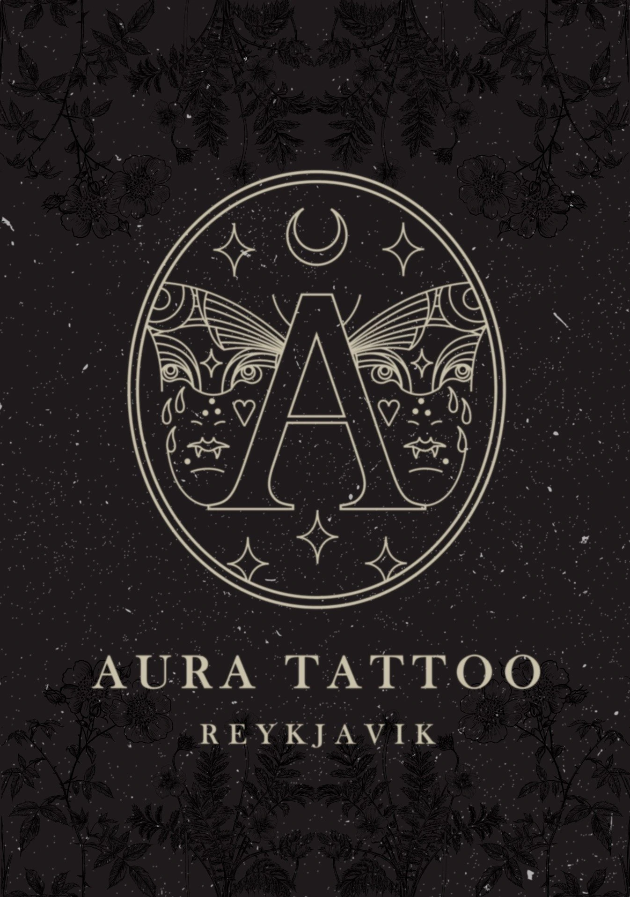

 

<h3 align="center">Aura Tattoo</h3>

<a href="https://auratattooreykjavik.com/">View Demo.</a>

## About The Project

Aura Tattoo is a website for a tattoo studio in Reykjavik, Iceland. The website is built with Next.js and Sass. It is a simple and clean design that is easy to navigate. The website is fully responsive and works on all devices. The website is hosted on Netlify and uses Hygraph as a Headless CMS solution. All forms are handled by EmailJs.

### Built With

- [Next](https://nextjs.org)
- [Sass](https://sass-lang.com)
- [EmailJs](https://www.emailjs.com)
- [React Hook Form](https://react-hook-form.com)
- [Motion](https://motion.dev/)
- [Netlify](https://www.netlify.com)

## Collaborators

Sebastian Lenart - [LenySebski](https://github.com/LenySebski)

Inuk Ryjewski - [Ryjekk](https://github.com/Ryjekk)

Project Link: [Repo](https://github.com/Ryjekk/AuraTattoo)
